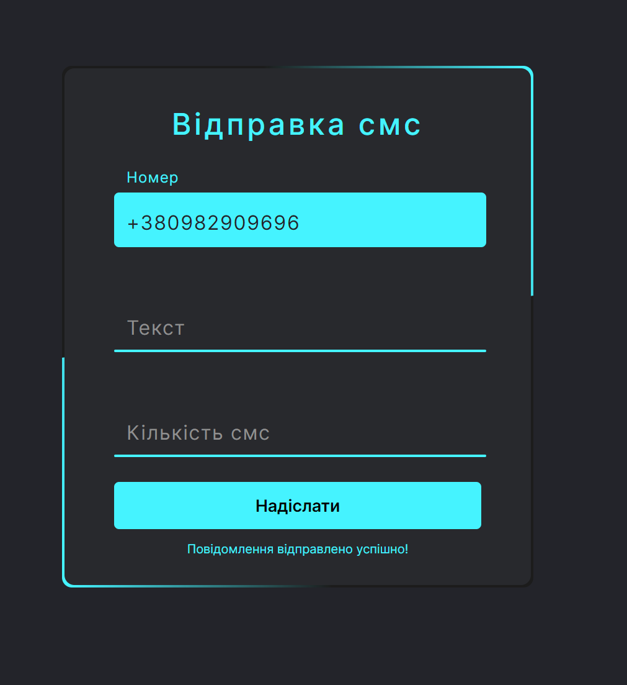

# SendPhoneMessageProgram-Python-web-design-

Проста программа із красивим дизайном виконана для курсової роботи із темою "Комп'ютерна система відправки телефонних повідомлень"

1. Для того щоб запустити проект потрібно зареєструватись на сайті https://www.twilio.com/
2. Зайти на цьому сайті у свій кабінет та скопіювати сід акаунта, і авторський токен після чого вставити їх у 12 та 13 рядки у файлі "main.py" відповідно
```python
account_sid = "AAa00a0000a0aaaa0a000a0aaa0000a000"
author_tocken = "aa000a00aa000aaa0000aa000000a0aa"
```
3. По стандарту ви зможете надсилати повідомлення лише на 1 номер телефону, той на який зареєстрований акаунт. Щоб надіслати повідомлення на інший номер телефону вам потрібно буде зайти у проект на сайті twilio, знайти кнопку "додати номер", ввести номер який хочете додати після чого на цей номер телефону прийде смс підтвердження ввівши його ви додасте цей номер для надсилання повідомлень (Анти спам система).
4. Встановити необхідні бібліотеки із потрібною версією застосовуючи pip
```pip
pip install -r requirements.txt
``` 
5. Запустити файл "main.py" після чого у вас відкриється программа, введіть туди необхідні дані та жміть кнопку "надіслати"
(Під кнопкою вам виведеться повідомлення про успішність або неуспішність виконання программи)
 Або 